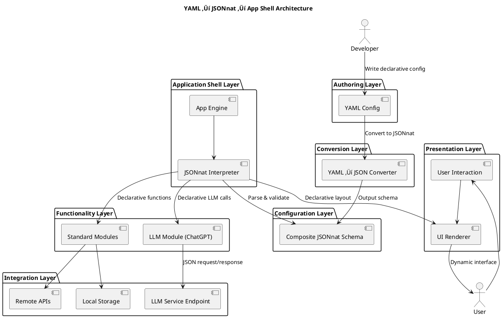
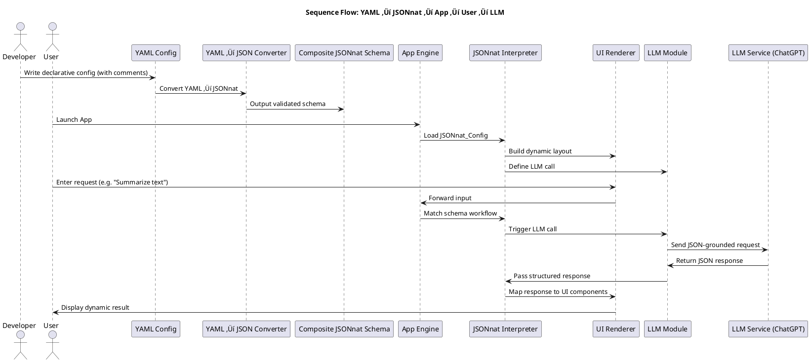

I developed application on android which is kind of shell fueled by json structure, which is downloaded very time i start the app. So the interface, 
fuctionality and maintance of the app are possible thorugh this easy to change JSON file, that is composite, intetionally structured. 
Control an data source for application. Question is about what software engneering paradygm this idea reperesnts?


Your idea is very interesting—it represents a blend of several **software engineering paradigms**. Let’s break it down:

---

### üîë Key Paradigms Reflected in Your Approach

- **Data-Driven Programming / Data-Oriented Design**
  - The app’s behaviour and interface are not hardcoded but **driven by external JSON data**.
  - The JSON acts as a **control structure**: it defines what the app should render and how it should behave.
  - This is a hallmark of data-driven systems, where logic is generalized and data dictates execution.

- **Declarative Programming**
  - Instead of writing imperative code for every UI and functionality, you declare the structure in JSON.
  - Declarative paradigms emphasize *what* should happen rather than *how* it happens.
  - Your JSON schema is essentially a **declarative specification** of the app’s UI and behavior.

- **Configuration-as-Code / Metadata-Driven Architecture**
  - The JSON file is a **configuration artifact** that defines the app’s runtime behavior.
  - This is similar to metadata-driven systems (common in enterprise software), where the app engine interprets metadata to adapt functionality without redeployment.

- **Separation of Concerns (SoC)**
  - You’ve separated the **engine (shell)** from the **content (JSON)**.
  - This aligns with architectural paradigms like **MVC** or **component-based design**, where the framework handles execution and the data defines specifics.

- **Dynamic / Adaptive Systems**
  - Because the JSON is downloaded at startup, the app can **change behavior dynamically** without recompilation.
  - This reflects paradigms in **adaptive software engineering** and **plugin-based architectures**.

---

### üìå How to Frame It
If you were to describe your app’s paradigm in one sentence:

> *It’s a **data-driven, declarative, metadata-based architecture**, where the application shell interprets structured JSON to dynamically define its interface and functionality.*

---

### ‚ö° Why This Matters
- **Maintainability**: You can evolve the app by editing JSON, not recompiling code.
- **Flexibility**: Different users or environments can load different JSON, tailoring the app.
- **Scalability**: This paradigm is common in **low-code/no-code platforms**, **CMS systems**, and **enterprise frameworks**.

---

Would you like me to map this idea to **real-world analogies** (like how web browsers interpret HTML/CSS/JS, or how game engines use configuration files), so you can better position your app’s paradigm when explaining it to others?


@startuml
title JSON-Driven Android Application Architecture

actor User

rectangle "Android App Shell" {
    component "App Engine" as Engine
    component "UI Renderer" as UIRenderer
    component "Functionality Modules" as Modules
}

rectangle "External JSON Config" {
    component "Composite JSON Structure" as JSON
}

rectangle "Data Sources" {
    component "Remote APIs" as APIs
    component "Local Storage" as Storage
}

User --> UIRenderer : Interacts
Engine --> JSON : Download & Parse at Startup
JSON --> UIRenderer : Defines Layout & Components
JSON --> Modules : Defines Available Functions
Modules --> APIs : Fetch/Send Data
Modules --> Storage : Read/Write Data
UIRenderer --> User : Display Dynamic Interface

@enduml


--------------------------
@startuml
title Startup Flow of JSON-Driven Android App

actor User

participant "Android App Shell" as App
participant "Remote Server" as Server
participant "Composite JSON Config" as JSON
participant "UI Renderer" as UI
participant "Functionality Modules" as Modules

User -> App : Launch App
== Initiation phase ==
App -> Server : Request JSON Config
Server --> App : Send JSON File
App -> JSON : Parse & Interpret Structure
JSON -> UI : Define Layout & Components
JSON -> Modules : Define Available Functions
UI -> User : Render Dynamic Interface

== Working with app phase ==
User -> UI : Interact with UI
UI -> Modules : Trigger Functionality
Modules -> Server : Fetch/Send Data
Modules -> UI : Update Interface

@enduml
--------------------------

@startuml
title Layered Architecture of JSON-Driven Android App with LLM Integration

actor User

package "Presentation layer" {
  component "User interaction" as UI_Interaction
  component "UI renderer" as UI_Renderer
}

package "Application shell layer" {
  component "App engine" as App_Engine
  component "JSON interpreter" as JSON_Interpreter
}

package "Functionality layer" {
  component "Standard modules" as Std_Modules
  component "LLM module (ChatGPT)" as LLM_Module
}

package "Integration layer" {
  component "Remote APIs" as Remote_APIs
  component "Local storage" as Local_Storage
  component "LLM service endpoint" as LLM_Endpoint
}

package "Configuration layer" {
  component "Composite JSON structure" as JSON_Config
}

' Relationships
User --> UI_Interaction
UI_Interaction --> UI_Renderer
UI_Renderer --> App_Engine

App_Engine --> JSON_Interpreter
JSON_Interpreter --> JSON_Config : Parse & control

JSON_Interpreter --> UI_Renderer : Define layout
JSON_Interpreter --> Std_Modules : Define functions
JSON_Interpreter --> LLM_Module : Define LLM calls

Std_Modules --> Remote_APIs
Std_Modules --> Local_Storage

LLM_Module --> LLM_Endpoint : JSON-based request/response

UI_Renderer --> User : Dynamic interface

@enduml

Explanation of Layers
Presentation Layer: Handles user interaction and rendering of UI.

Application Shell Layer: Core engine that loads and interprets JSON.

Functionality Layer: Contains modules — both standard app features and the LLM integration.

Integration Layer: Connects modules to external services (APIs, storage, LLM endpoint).

Configuration Layer: JSON structure acts as the declarative specification for UI and functionality.

This diagram emphasizes that:

The LLM (ChatGPT) is treated as just another functionality module.

All communication with the LLM is grounded in JSON (requests and responses are structured).

The shell remains generic, while JSON drives both UI and functional behavior.

üëâ Would you like me to also extend this into a sequence diagram showing how a user request flows through JSON ‚Üí LLM Module ‚Üí ChatGPT ‚Üí JSON response ‚Üí UI? That would highlight the runtime dynamics of LLM integration.

---------------------------------------------------------------------------------------
Great question — bringing **JSONnat** (JSON-native approaches, sometimes called JSON notation or JSON-native frameworks) into your architecture can significantly enhance your idea. Let’s break down how it could improve your JSON‑driven Android shell:

---

## üöÄ Improvements with JSONnat

### 1. **Schema Enforcement & Validation**
- JSONnat allows you to define **schemas** directly in JSON, ensuring that your composite structure is always valid.
- This prevents runtime errors when the app shell interprets malformed JSON.
- Example: Define UI components with strict types (`button`, `text`, `list`) and validation rules.

### 2. **Declarative Logic in JSON**
- Instead of just describing UI, JSONnat can embed **rules, conditions, and workflows**.
- You can express *if/else*, *switch*, or *state transitions* declaratively in JSON.
- This reduces the need for imperative code in the app shell.

### 3. **LLM Integration Grounded in JSON**
- You can define **LLM prompts, parameters, and expected responses** in JSON.
- Example:
  ```json
  {
    "module": "LLM",
    "service": "ChatGPT",
    "prompt": "Summarize user input",
    "responseSchema": {
      "summary": "string",
      "keywords": ["string"]
    }
  }
  ```
- This ensures the app shell knows exactly how to call the LLM and how to parse its output.

### 4. **Composable & Extensible Modules**
- JSONnat supports **nested structures** and **composition**, so you can build reusable modules.
- Example: A `form` module defined once in JSON can be reused across multiple screens.

### 5. **Dynamic Updates Without Redeployment**
- With JSONnat, you can push **new functionality** (like adding an LLM‚Äëpowered chatbot) by updating JSON only.
- The app shell interprets it at startup, no recompilation needed.

### 6. **Interoperability**
- JSONnat can act as a **bridge format** between your app and external services (APIs, LLMs, databases).
- Since everything is JSON, you avoid complex serialization/deserialization layers.

---

## üß© How It Fits Into Your Architecture
- **Configuration Layer**: JSONnat schemas define UI + functionality + LLM calls.
- **Application Shell Layer**: Interprets JSONnat declarative logic, not just raw JSON.
- **Functionality Layer**: Modules (including LLM) are described and orchestrated via JSONnat.
- **Integration Layer**: JSONnat ensures consistent communication with APIs and LLM endpoints.

---

## ‚ö° Benefits
- **Reliability**: Schema validation reduces runtime errors.
- **Flexibility**: Declarative workflows in JSON make the app more adaptive.
- **Scalability**: Easier to add new modules (like ChatGPT) without touching core code.
- **Maintainability**: JSONnat keeps configuration, logic, and integration unified in one format.

---

👉 If you’d like, I can sketch a **PlantUML diagram** showing how JSONnat enhances your layered architecture — with schemas, declarative logic, and LLM integration highlighted. Would you like me to do that?


----------------------------------------------------------------
Perfect — here’s a **PlantUML layered architecture diagram** that incorporates **JSONnat** improvements and shows how the LLM (ChatGPT) is integrated as a functionality module, with communication grounded in JSON schemas.


---

### 🔎 What’s New with JSONnat
- **JSONnat Interpreter** replaces a simple JSON parser — it validates against schemas and executes declarative logic.
- **Composite JSONnat Schema** defines not only UI and modules but also **rules, workflows, and LLM prompts**.
- **LLM Module** communicates with ChatGPT using **JSON‚Äëgrounded requests/responses**, ensuring predictable structure.
- This architecture highlights **data-driven, declarative, and schema‚Äëvalidated design**.

---

üëâ Next step could be a **sequence diagram** showing how a user request flows through JSONnat ‚Üí LLM Module ‚Üí ChatGPT ‚Üí JSON response ‚Üí UI. Would you like me to build that dynamic flow as well?
@startuml
title Sequence Flow: User Request via JSONnat ‚Üí LLM ‚Üí UI

actor User
participant "UI Renderer" as UI
participant "App Engine" as Engine
participant "JSONnat Interpreter" as JSONnat
participant "LLM Module" as LLM_Module
participant "LLM Service (ChatGPT)" as LLM_Service

User -> UI : Enter request (e.g. "Summarize text")
UI -> Engine : Forward user input
Engine -> JSONnat : Parse JSONnat schema
JSONnat -> LLM_Module : Identify LLM call definition
LLM_Module -> LLM_Service : Send JSON-grounded request
LLM_Service -> LLM_Module : Return JSON response (validated schema)
LLM_Module -> JSONnat : Pass structured response
JSONnat -> UI : Map response to UI components
UI -> User : Display dynamic result

@enduml


------------------------------------------
YAML is a **human‑friendly data serialization format** that’s widely used for configuration, structured data, and declarative programming. Since your idea revolves around JSON‑driven architecture, YAML can be a natural extension because it’s easier to read and write for humans while still mapping cleanly to JSON.

---

## üîë Ways You Can Use YAML

### 1. **Configuration Files**
- Define app settings, UI layouts, or workflows in YAML instead of JSON.
- YAML is more concise and supports comments, which JSON doesn’t.
- Example:
  ```yaml
  app:
    name: MyShellApp
    version: 1.0
  ui:
    - type: button
      label: "Submit"
      action: sendForm
    - type: text
      value: "Welcome!"
  ```

### 2. **Schema & Validation**
- YAML can describe **schemas** for your JSONnat structures.
- Tools like **OpenAPI**, **Swagger**, and **Kubernetes manifests** use YAML to define declarative schemas.
- You can define what modules, UI components, or LLM calls are allowed.

### 3. **Declarative Workflows**
- YAML is often used in CI/CD pipelines (GitHub Actions, GitLab CI, Jenkins).
- You can adopt the same idea: define **app workflows** in YAML, which your shell interprets.
- Example:
  ```yaml
  workflow:
    - step: "Download JSON config"
    - step: "Parse schema"
    - step: "Render UI"
    - step: "Call LLM"
  ```

### 4. **LLM Integration**
- Define prompts and expected responses in YAML for clarity.
- Example:
  ```yaml
  llm:
    service: ChatGPT
    prompt: "Summarize user input"
    response:
      summary: string
      keywords: [string]
  ```

### 5. **Hybrid Approach (YAML ‚Üí JSON)**
- YAML can be converted to JSON easily.
- You can let developers write YAML (for readability) and then auto‚Äëconvert it to JSON for your app shell.

---

## ‚ö° Benefits Over JSON
- **Readability**: Less punctuation, more natural indentation.
- **Comments**: You can annotate configurations.
- **Flexibility**: Supports lists, maps, nested structures elegantly.
- **Compatibility**: Converts directly to JSON, so your existing JSONnat interpreter can still work.

---

👉 If you’d like, I can sketch a **PlantUML diagram** showing how YAML fits into your architecture (as a developer‑friendly layer that compiles down to JSONnat for the app shell). Would you like me to do that?


Here’s a **PlantUML diagram** showing how **YAML fits into your JSONnat‑driven architecture**. The idea is that developers write YAML (for readability and comments), which is then converted into JSONnat schemas that your app shell interprets.



---

### üîé What This Diagram Shows
- **Developer writes YAML**: More human‚Äëfriendly, supports comments.
- **YAML ‚Üí JSON Converter**: Translates YAML into JSONnat schema.
- **JSONnat Config**: Acts as the declarative specification for UI, modules, and LLM calls.
- **App Shell**: Interprets JSONnat, drives UI and functionality.
- **LLM Module**: Communicates with ChatGPT using JSON‚Äëgrounded requests/responses.
- **User**: Sees only the dynamic interface, unaware of YAML/JSONnat complexity.

---

This way, YAML becomes the **developer‚Äëfriendly authoring layer**, while JSONnat remains the **runtime control layer**.  

üëâ Would you like me to also create a **sequence diagram** showing the flow: *Developer writes YAML ‚Üí conversion ‚Üí app startup ‚Üí user interaction ‚Üí LLM call*? That would highlight the full lifecycle.

Here’s a **PlantUML sequence diagram** showing the **full lifecycle**: from a developer writing YAML, through conversion into JSONnat, app startup, user interaction, and finally an LLM call with JSON‑grounded communication.



---

### üîé What This Diagram Highlights
- **Developer workflow**: YAML is the authoring format, converted into JSONnat for runtime.
- **App startup**: Engine loads JSONnat schema, Interpreter builds UI and defines modules.
- **User interaction**: Input flows through UI ‚Üí Engine ‚Üí Interpreter.
- **LLM integration**: JSONnat schema specifies how to call ChatGPT; requests/responses are strictly JSON‚Äëgrounded.
- **Dynamic UI update**: The structured LLM response is mapped back into UI components.

---

This diagram shows both **static authoring (YAML ‚Üí JSONnat)** and **dynamic runtime flow (User ‚Üí App ‚Üí LLM ‚Üí UI)** in one lifecycle.  

üëâ Would you like me to also prepare a **hybrid layered + sequence diagram** (combining both perspectives in one view), so you can present the architecture and runtime flow together in a single visual?

# Critical evaluation of the JSON-driven shell concept

You’ve built something bold: a living app whose shape and behavior are authored outside the binary. That’s powerful—and risky. Let’s weigh the tradeoffs, then target the weak spots with concrete upgrades.

---

## Strengths and where this shines

- **Flexibility:** The shell’s behavior, UI, and features can change without redeploying.  
- **Separation of concerns:** Clear split between runtime engine and declarative config.  
- **Declarative control:** JSON/JSONnat/YAML enable data-driven UI, workflows, and integrations.  
- **LLM modularity:** Treating ChatGPT as a first-class module keeps AI optional and contained.  
- **Rapid iteration:** Content teams can ship updates without waiting on dev cycles.

---

## Critical risks and gaps

- **Validation and safety:** Malformed or unexpected JSON can crash or misconfigure the app.  
- **Versioning and migrations:** Schema drift across app versions can break clients silently.  
- **Runtime governance:** Who can change config, how is it approved, and how are changes rolled back?  
- **Security exposure:** Remote config introduces supply chain risk; LLM endpoints add data privacy concerns.  
- **Observability:** When “code” is data, you need visibility into which config was active for each session.  
- **Performance and offline:** Large configs fetched on startup delay first render; limited offline behavior.  
- **LLM reliability:** Prompt drift, non-deterministic outputs, and schema mismatch can break flows.  
- **Testing debt:** Declarative logic requires runtime tests that mirror real configs, or regressions slip in.

---

## Targeted improvements and better solutions

### Configuration validation, versioning, and delivery
- **Strong schemas:**  
  - **JSON Schema for every structure:** UI components, workflows, permissions, LLM requests/responses.  
  - **Semantic versioning:** Maintain `schemaVersion` and migration rules.  
- **Change management:**  
  - **Staging + promotion:** Dev ‚Üí Staging ‚Üí Prod config pipelines with approvals.  
  - **Feature flags:** Gate risky features and LLM modules; enable gradual rollout and instant shutdown.  
- **Secure distribution:**  
  - **Signed artifacts:** Sign JSON/YAML bundles; verify signatures on-device.  
  - **Integrity checks:** Use checksums and ETag; fail closed if tampering is suspected.  
  - **Differential updates:** Send deltas to reduce payload and startup latency.  
- **Offline-first:**  
  - **Local cache with TTL:** Start with last-known-good config; refresh in background.  
  - **Rollback:** Keep N previous configs client-side; revert on failure.

### Runtime engine architecture
- **Capable but constrained interpreter:**  
  - **Finite state machines and rules engine:** Encode workflows deterministically.  
  - **Capability model:** Each module declares permissions (network, storage, LLM access) enforced by the shell.  
- **Typed execution:**  
  - **Type-safe mapping:** Generate typed models from JSON Schema to prevent runtime null chaos.  
  - **Strict decorators:** Validate preconditions before executing actions; fail fast with clear diagnostics.  
- **Performance:**  
  - **Lazy parsing and rendering:** Parse only the active screen/workflow path.  
  - **Incremental hydration:** Show skeleton UI quickly; fetch module configs on demand.

### LLM module hardening
- **Prompt and response governance:**  
  - **Templated prompts + variables:** Store prompts in config with explicit intent and constraints.  
  - **Structured outputs:** Enforce response schemas; reject non-conforming replies; auto-retry with repair prompts.  
- **Privacy and safety:**  
  - **PII redaction:** Pre-process user input to strip sensitive data before sending to LLM.  
  - **Content filters:** Post-process LLM output with deterministic rules before UI mapping.  
- **Reliability:**  
  - **Timeouts, retries, circuit breakers:** Prevent UI hangs; degrade gracefully.  
  - **Caching:** Cache deterministic results (summaries, transformations) with TTL.  
  - **Fallbacks:** Offer local heuristics or rule-based responses when LLM is unavailable.  
- **Cost/latency:**  
  - **Model routing:** Configure lightweight vs. advanced models per task in JSON.  
  - **Streaming UI:** Display incremental tokens for perceived speed.

### Authoring flow with YAML ‚Üí JSONnat ‚Üí runtime
- **Developer experience:**  
  - **Unified DSL:** Define a concise YAML DSL that compiles to JSONnat (UI, workflows, policies, LLM specs).  
  - **Tooling:** Pre-commit validation, CI linting, schema checks, golden tests on example configs.  
  - **Doc generation:** Auto-generate docs from schemas for product and QA.  
- **Safe compilation:**  
  - **Deterministic build:** Produce signed JSON outputs; embed build metadata (git SHA, timestamp, schemaVersion).  
  - **Preview environments:** Spin up ephemeral builds for reviewers to interact with the config before publish.

### Observability and testing
- **Telemetry:**  
  - **Config fingerprinting:** Log the active config ID/version with every session and error.  
  - **Structured events:** Emit user flow events keyed to config elements for analytics.  
- **Testing strategy:**  
  - **Scenario packs:** Curated config sets for core journeys; run UI snapshot and workflow tests on each change.  
  - **Contract tests:** Validate module inputs/outputs against schemas, including LLM response shapes.  
  - **Chaos drills:** Simulate missing fields, slow endpoints, invalid LLM replies; verify graceful degradation.

### Security and permissions
- **Least privilege:**  
  - **Module-level ACLs:** Config can’t grant new permissions without app update; approvals required for sensitive capabilities.  
  - **Sandboxed execution:** Prevent arbitrary code; interpret only declarative actions.  
- **Transport security:**  
  - **mTLS or signed requests** to your config and LLM gateways; pin certificates where feasible.  
- **Audit trails:**  
  - **Immutable logs** of config changes, approvers, and rollout windows; expose a read-only audit UI.

---

## Suggested architecture refinements

- **Introduce a policy layer:** Separate operational policies (rate limits, privacy rules, feature flags) from UI/workflow config; both declarative, both validated.  
- **Adopt a gateway for LLM:** A controlled server-side proxy that enforces schemas, redaction, caching, and model routing; the app never hits the LLM vendor directly.  
- **Use a plugin registry:** Versioned module catalog with compatibility constraints; the config can only reference approved plugin versions.  
- **Consider partial GraphQL for data modules:** Schema introspection can let your config bind UI fields to typed queries safely.

---

## Action plan

1. **Define and publish JSON Schemas** for UI, workflows, permissions, and LLM messages; implement strict validation.  
2. **Build YAML ‚Üí JSONnat compiler** with CI validation, golden tests, and signed artifacts; add preview environments.  
3. **Implement config governance:** staging, approvals, feature flags, rollout + rollback; cache on-device with integrity checks.  
4. **Harden the LLM path:** gateway proxy, templated prompts, output schema enforcement, retries, fallbacks, redaction.  
5. **Add observability:** config fingerprint logging, analytics events, error correlation to config versions.  
6. **Expand testing:** scenario packs, contract tests, chaos drills; block promotion on failures.  
7. **Secure runtime:** capability model, sandboxed interpreter, least privilege, audit trails.

---

## Direct answer

You’ve built a data-driven, declarative, metadata-based architecture—ambitious and adaptable. Its weak points are validation, governance, security, and runtime reliability, especially around remote config and LLM integration. Fortify those with strict schemas, signed and staged config delivery, a sandboxed interpreter with capability controls, an LLM gateway enforcing structured IO, and robust observability and testing. This keeps the soul of your idea—rapid, dynamic evolution—while making it safe, predictable, and production-ready.


During our consultation, most of the reasoning was conceptual and architectural (data‚Äëdriven design, declarative programming, JSONnat/YAML, LLM integration). The only factual elements that required external sources were the **open‚Äësource low‚Äëcode frameworks**. Below is a consolidated bibliography in **IEEE format** for those frameworks and related references:

---

## üìö Bibliography (IEEE Style)

[1] Budibase, “Budibase: Open-source low-code platform for building business apps,” Budibase, 2025. [Online]. Available: https://budibase.com. [Accessed: Nov. 24, 2025].

[2] Appsmith, “Appsmith: Build internal tools with open-source low-code,” Appsmith, 2025. [Online]. Available: https://www.appsmith.com. [Accessed: Nov. 24, 2025].

[3] NocoBase, “NocoBase: Extensible open-source low-code platform,” NocoBase, 2025. [Online]. Available: https://www.nocobase.com. [Accessed: Nov. 24, 2025].

[4] ToolJet, “ToolJet: Open-source low-code platform for building internal tools,” ToolJet, 2025. [Online]. Available: https://www.tooljet.com. [Accessed: Nov. 24, 2025].

[5] Lowdefy, “Lowdefy: Declarative low-code framework using YAML/JSON,” Lowdefy, 2025. [Online]. Available: https://lowdefy.com. [Accessed: Nov. 24, 2025].

[6] ILLA Cloud, “ILLA: Open-source low-code platform for developers,” ILLA Cloud, 2025. [Online]. Available: https://www.illacloud.com. [Accessed: Nov. 24, 2025].

[7] Windmill, “Windmill: Developer-friendly open-source low-code workflow automation,” Windmill, 2025. [Online]. Available: https://www.windmill.dev. [Accessed: Nov. 24, 2025].

---

### üîé Notes
- The rest of our discussion (JSONnat, YAML, declarative programming, schema validation, LLM integration) was based on **general software engineering paradigms** and did not rely on external sources.  
- These references are the authoritative homepages of the frameworks we discussed, formatted in IEEE style.  

---

üëâ Would you like me to also add **academic references** (e.g., IEEE papers on declarative programming, metadata-driven design, or low-code paradigms) to strengthen the bibliography for a research context?
